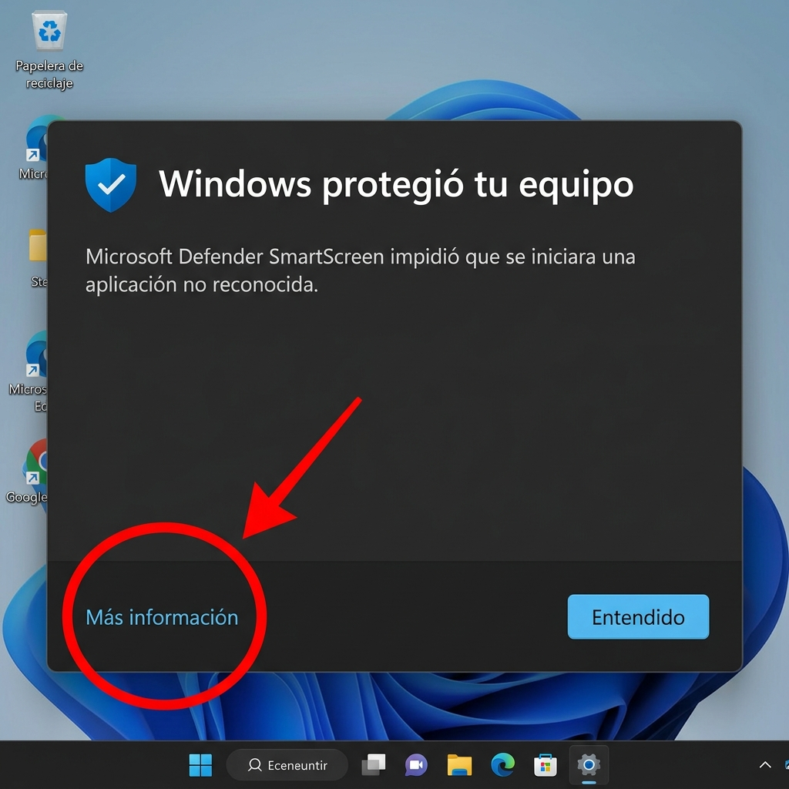
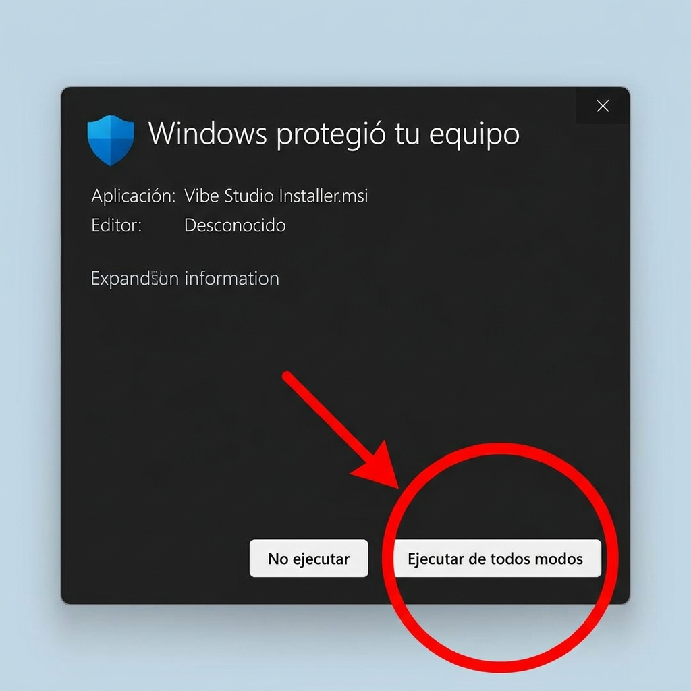

# 🚀 Guía de Instalación — Vibe Studio (Windows)

Vibe Studio es 100% seguro. Windows puede mostrar un aviso porque la app aún no tiene firma digital — es completamente normal para aplicaciones nuevas e independientes.

Sigue estos 2 pasos rápidos para instalar sin problemas:

---

## Paso 1: Haz clic en "Más información"

Cuando descargues e intentes abrir el instalador, Windows mostrará una ventana de protección. **No te preocupes** — esto sucede con TODAS las aplicaciones que no pagan una firma digital (que cuesta más de $400 al año).

Haz clic en el enlace **"Más información"** que aparece en azul:

---

## Paso 2: Haz clic en "Ejecutar de todos modos"

Después de hacer clic en "Más información", verás un botón adicional. Haz clic en **"Ejecutar de todos modos"** para continuar con la instalación:

---

## ¡Listo! 🎉

La instalación continuará normalmente. Vibe Studio se abrirá y estarás listo para vibecodeear en español.

---

❓ ¿Por qué aparece este aviso?

Microsoft SmartScreen muestra esta advertencia cuando una aplicación no tiene un **certificado de firma digital** (code signing certificate). Estos certificados cuestan entre $99 y $400 al año. Como proyecto independiente, aún no contamos con uno — pero tu seguridad es nuestra prioridad:

- ✅ El código de Vibe Studio es **open source** — puedes revisarlo tú mismo
- ✅ Los instaladores se generan automáticamente en **GitHub Actions** — sin intervención manual
- ✅ Cada release incluye **checksums** para verificar que el archivo no fue alterado

A medida que crezcamos, invertiremos en la firma digital para eliminar este paso.

🍎 ¿Usas macOS?

En macOS, si Gatekeeper bloquea la app:

1. Abre **Preferencias del Sistema** → **Privacidad y Seguridad**
2. Busca el mensaje sobre Vibe Studio y haz clic en **"Abrir de todos modos"**
3. Confirma en el diálogo que aparece

