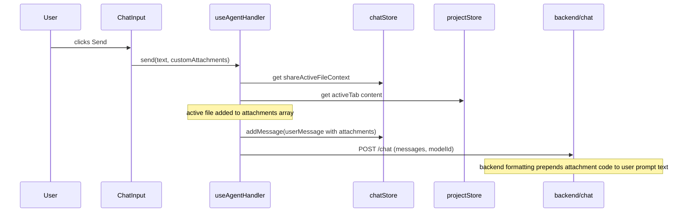
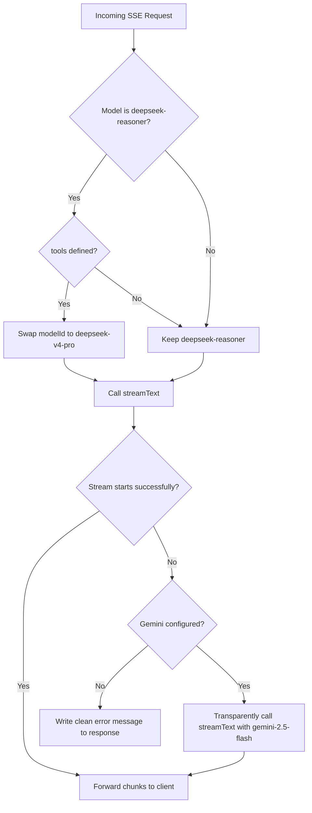

# Design: Editor-Chat Integration Architecture Polish

## 1. Data & State Architecture

### A. Model Registry Updates (`src/providers/registry.ts`)
We will expand the static configurations for DeepSeek and Gemini to register the official V4 models:

```typescript
const DEEPSEEK_MODELS: ModelConfig[] = [
  {
    id: "deepseek-v4-flash",
    name: "Opita Flash",
    providerId: "deepseek",
    maxTokens: 8192,
    temperature: 0.7,
    costPer1kInput: 0,
    costPer1kOutput: 0,
    tier: "free",
  },
  {
    id: "deepseek-v4-pro",
    name: "Opita Pro",
    providerId: "deepseek",
    maxTokens: 8192,
    temperature: 0.7,
    costPer1kInput: 0,
    costPer1kOutput: 0,
    tier: "free",
  },
  {
    id: "deepseek-reasoner",
    name: "Opita Architect",
    providerId: "deepseek",
    maxTokens: 8192,
    temperature: 0.7,
    costPer1kInput: 0,
    costPer1kOutput: 0,
    tier: "free",
  }
];

const GEMINI_MODELS: ModelConfig[] = [
  {
    id: "gemini-2.5-flash",
    name: "Gemini Flash",
    providerId: "gemini",
    maxTokens: 8192,
    temperature: 0.7,
    costPer1kInput: 0,
    costPer1kOutput: 0,
    tier: "free",
  },
  {
    id: "gemini-2.5-pro",
    name: "Gemini Pro",
    providerId: "gemini",
    maxTokens: 8192,
    temperature: 0.7,
    costPer1kInput: 0,
    costPer1kOutput: 0,
    tier: "free",
  }
];
```

### B. Chat Store Plan Locks & Context State (`src/stores/chat.ts`)
We will add `shareActiveFileContext` to the persisted chat state and define locking tiers for manual selection:

```typescript
interface ChatState {
  // ... existing fields ...
  shareActiveFileContext: boolean;
}

interface ChatActions {
  // ... existing actions ...
  setShareActiveFileContext: (share: boolean) => void;
}
```

**Locking Matrix in UI (`ChatInput.tsx`)**:
- `gemini-2.5-flash`: Tier 0 (`free`)
- `deepseek-v4-flash`: Tier 1 (`estudiante`)
- `deepseek-v4-pro`, `gemini-2.5-pro`, `deepseek-reasoner`: Tier 2 (`pro`)

---

## 2. Component Architecture

### A. Editor AI Quick Actions (`src/components/editor/EditorToolbar.tsx`)
We will add four actions to the right of the view layouts:
```
EditorToolbar
├── View controls (Solo Código / Split)
├── Divider
├── [NEW] AI Quick Actions
│   ├── Explicar button  (prompt: Explain)
│   ├── Optimizar button (prompt: Optimize)
│   ├── Fix button       (prompt: Fix)
│   └── Tests button     (prompt: Tests)
└── Project Run button
```

**Event Handler pseudo-code**:
```typescript
import { useUIStore } from "@/stores/ui";
import { useProjectStore } from "@/stores/project";
import { useChatStore } from "@/stores/chat";
import { useAgentHandler } from "@/agent";

function handleQuickAction(promptText: string) {
  const activeTab = useProjectStore.getState().activeTab;
  if (!activeTab) return;

  // 1. Expand chat panel if closed
  if (!useUIStore.getState().chatVisible) {
    useUIStore.getState().toggleChatVisible();
  }

  // 2. Access useAgentHandler to send prompt
  const handler = useAgentHandler();
  handler.send(promptText);
}
```

### B. Active File Context Indicator (`src/components/chat/ChatInput.tsx`)
We will render a context toggle bar right above the text input:
```
+-------------------------------------------------------------+
| 📎 Compartir contexto: index.tsx (142 líneas)       [X] [o] |
+-------------------------------------------------------------+
| [Attachment] Write message here...                      [>] |
+-------------------------------------------------------------+
```

**Large File Guard logic**:
```typescript
useEffect(() => {
  if (activeTab) {
    const activeContent = projectStore.fileContents[activeTab] ?? "";
    const lines = activeContent.split("\n").length;
    if (lines > 1500) {
      chatStore.setShareActiveFileContext(false);
      setContextWarning("Archivo demasiado grande (>1500 líneas). Contexto desactivado para ahorrar tokens.");
    } else {
      setContextWarning(null);
    }
  }
}, [activeTab]);
```

---

## 3. Data Flow

### A. Active File Injection (`src/agent/useAgentHandler.ts`)
Upon sending a message, if `shareActiveFileContext` is enabled, the active file is dynamically added as a text attachment:



### B. Backend Safety & Fallbacks (`packages/vibe-ai-backend/src/api/chat.ts`)



---

## 4. Delivery & Phase Breakdown (Chained PRs)

### PR 1: Catálogo de Modelos y Bloqueos de Plan (~200 LOC)
- `src/providers/registry.ts`: Register DeepSeek V4 and Gemini V2 models.
- `src/stores/chat.ts`: Add `shareActiveFileContext` state and action.
- `src/components/chat/ChatInput.tsx`: Implement model locking based on plan tiers and check-out triggers.

### PR 2: Acciones Rápidas del Editor (`EditorToolbar`) (~150 LOC)
- `src/components/editor/EditorToolbar.tsx`: Add action buttons.
- Connect buttons to dynamic chat injection and open panel state.

### PR 3: Inyección de Contexto en Chat y Guardas de Tamaño (~250 LOC)
- `src/components/chat/ChatInput.tsx`: Implement the active context bar with the warning and toggle switch.
- `src/agent/useAgentHandler.ts`: Intercept `send()` to attach the active file context dynamically.

### PR 4: Backend Fallbacks y Protección de Tool Calling (~180 LOC)
- `packages/vibe-ai-backend/src/api/chat.ts`: Map models, downgrade `deepseek-reasoner` when tools are present, and add reciprocal provider fallback to Gemini.
