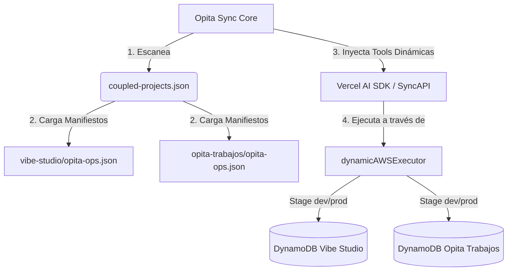

# Auditoría Arquitectónica y Reestructuración: Opita Sync

**Preparado por**: Antigravity (Architect & GDE/MVP)  
**Fecha**: 2026-05-23  
**Estado**: Bajo Revisión del Fundador  

---

## 1. Diagnóstico del Trabajo Anterior (`opita-sync`)

El repositorio anterior de `opita-sync` contiene una gran cantidad de planeación conceptual y un prototipo de simulación en TypeScript (`opita-office-sandbox`), pero presenta desafíos de diseño y acoplamiento que limitan su capacidad para integrarse con el ecosistema actual de Opita Code.

### Lo que tenemos hoy:
1.  **59 Documentos de Planificación y Pilotos**: Contienen la especificación conceptual de OSF (Opita Sync Framework) y auditorías de observabilidad.
2.  **Mocks de Datos Estáticos (`opita-office-sandbox`)**: Simula una operación de oficina (`customers`, `orders`, `inventory`, `tasks`, `agentJournal`) ejecutando transiciones de estado en memoria.
3.  **Core de IA Acoplado**: El backend en `vibe-studio/packages/vibe-ai-backend/src/api/admin.ts` (asistente conversacional de operaciones) tiene herramientas de base de datos acopladas de manera estática a las variables de entorno de Vibe Studio.

---

## 2. Evaluación Quirúrgica: ¿Qué Sirve y Qué se Modifica?

### A. Lo que Conservamos (El Core Conceptual)
*   **El Corredor de Gobernanza**: El ciclo de vida de operaciones en 6 fases:
    $$\text{Intake} \longrightarrow \text{Proposal} \longrightarrow \text{Preview} \longrightarrow \text{Governance (Approval)} \longrightarrow \text{Execution} \longrightarrow \text{Inspection/Recovery}$$
*   **Regla de Oro de OSF**: *El chat libre de IA nunca aplica cambios directos*. Toda intención en lenguaje natural debe traducirse primero en un artefacto propuesto (`proposal_draft`) antes de ser ejecutado.
*   **Separación de Roles (RBAC)**:
    *   `Operator`: Crea propuestas y previsualiza impactos.
    *   `Approver`: Libera ejecuciones bloqueadas de alto riesgo.
    *   `Admin Tenant`: Configura los manifiestos y políticas.

### B. Lo que Debemos Modificar (La Brecha de Implementación)
*   **Desacoplar el Sandbox Estático**: El código en `opita-office-sandbox` está diseñado específicamente para un escenario de oficina ficticio (`customers`, `orders`). Debemos reemplazarlo por un **Runtime de Plugins Genérico** que pueda leer la estructura y capacidades de cualquier aplicación real de Opita Code (como `vibe-studio` o `opita-trabajos`).
*   **Normalizar el Manifiesto**: Mudar las definiciones de recursos en SSM/DynamoDB fuera del código de la Lambda de `admin.ts` y meterlas en archivos de configuración estándar (`opita-ops.json`) expuestos por cada aplicación.
*   **Persistencia Real vs Mocks**: Migrar el almacenamiento de auditoría (`event_records` y `foundation_runs`) a tablas compartidas de DynamoDB o PostgreSQL, abandonando el mock en memoria del sandbox.

---

## 3. Arquitectura Propuesta para el Ecosistema Opita Code

Para acoplar y desacoplar aplicaciones de forma estandarizada en Opita Sync, proponemos una arquitectura de **Microkernel (Plugin-Based)**:

### Componentes de Integración:
1.  **El Manifiesto (`opita-ops.json`)**: Cada aplicación en el workspace declara sus tablas de DynamoDB (SSM Paths) y las capacidades que le permite ejecutar a Opita Sync.
2.  **El Registro Central (`coupled-projects.json`)**: El archivo de configuración de Opita Sync que lista las rutas locales y estados de acoplamiento de los proyectos del ecosistema.
3.  **El Inyector Dinámico de AI (`dynamicToolInjector`)**: Lee los manifiestos de los proyectos acoplados y expone dinámicamente las herramientas correspondientes al LLM en Vercel AI SDK.

---

## 4. Secuencia de Reestructuración Recomendada

1.  **Fase 1: Estandarización de Contratos**: Crear el esquema JSON del manifiesto y los tipos de typescript compartidos para el acoplamiento.
2.  **Fase 2: Motor de Registro de Proyectos**: Escribir en `opita-sync` las herramientas de CLI/Chat para acoplar y desacoplar proyectos (modificando `coupled-projects.json`).
3.  **Fase 3: Generalización del Backend**: Limpiar el backend de `admin.ts` en `vibe-studio/packages/vibe-ai-backend` para eliminar variables acopladas de base de datos y usar el ejecutor dinámico de manifiestos.
